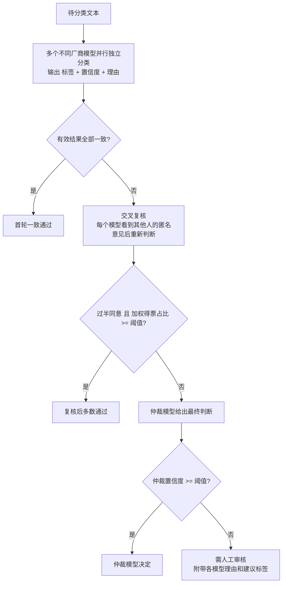

# CrossCheck：多模型互检分类

让多个大模型像多名标注员一样，对同一批文本**独立分类 → 交叉复核 → 仲裁 → 人工兜底**，用模型之间的相互检查来提升分类准确率，并把真正困难的样本筛出来交给人。

> 当前版本是 **v0.1 基础实现**，已接入真实模型并完成实测；进阶能力见下方 [项目规划](#项目规划roadmap)。

---

## 为什么要互检

- **不同模型的分类标准和准确率不同**：同一条文本，GPT、Claude、DeepSeek、Qwen 可能给出不同答案。
- **单个模型的错误难以发现**：模型答错时往往依然“很自信”。
- **不同厂商模型的错误相对独立**：多个模型同时犯同一个错的概率远低于单个模型犯错的概率，因此“一致”本身就是一个很强的质量信号，“分歧”则是一个天然的难例探测器。

互检的本质是把众包标注领域成熟的方法（多数投票、交叉审核、仲裁、Dawid-Skene 聚合、人工复核）迁移到大模型上。

---

## 工作流程



几个关键设计：

| 设计 | 目的 |
|---|---|
| 统一的分类手册（定义 + 正反例 + 边界规则） | 让所有模型按同一套标准判断，减少“标准不一致”造成的分歧 |
| 复核时隐去模型名、要求“理由更符合标准才修改” | 防止模型盲从多数或迎合强模型（sycophancy） |
| 加权投票（权重 × 置信度） | 准确率高的模型话语权更大，权重可由金标准自动计算 |
| 回复缓存 | 相同模型 + 相同提示词只调用一次，反复实验不重复付费 |
| mock 模式 | 没有 API key 也能跑通全流程 |

---

## 快速开始

### 1. 安装

```bash
pip install -r requirements.txt
```

依赖只有 `httpx` 和 `pyyaml`，Python 3.10+。

### 2. 用 mock 模式跑通流程（不需要 API key）

```bash
python -m crosscheck classify data/sample.csv --mock
python -m crosscheck evaluate data/gold.csv --mock
```

### 3. 接入真实模型

在项目根目录新建 `.env` 文件写入 key（已被 `.gitignore` 忽略，不会上传），程序启动时自动加载：

```ini
DEEPSEEK_API_KEY=sk-...
DASHSCOPE_API_KEY=sk-...      # 阿里云百炼：千问、Kimi、GLM 都可以通过它调用
MOONSHOT_API_KEY=sk-...       # Kimi 官方（可选）
```

```bash
python -m crosscheck ping      # 逐个测试模型是否可用
```

当前默认配置：投票模型为 `deepseek-flash`（DeepSeek 官方）、`kimi-k2.6`（百炼）、`qwen3.7-plus`（百炼），仲裁模型为 `glm-5.3`（百炼，第四家厂商，不偏向任何投票方）。

接入时的常见坑（已在 `config.yaml` 中处理）：

- 新一代模型多数默认开启“思考模式”，分类任务建议通过 `extra_body` 关闭以提速（DeepSeek：`thinking: {type: disabled}`；百炼：`enable_thinking: false`）
- Kimi 官方接口不允许 `temperature=0`（思考模式只允许 1，非思考只允许 0.6）
- 新注册账号限额很低（例如 Kimi 官方并发 1、每分钟 3 次），可用 `max_concurrency` / `rpm` 限流

`provider` 支持三种：

| provider | 适用 |
|---|---|
| `openai` | 所有 OpenAI 兼容接口：OpenAI、DeepSeek、通义千问、Kimi、智谱、大部分中转平台 |
| `anthropic` | Anthropic 原生 `/v1/messages` 接口 |
| `mock` | 假模型，用于测试 |

### 4. 推荐的使用顺序

```bash
# ① 在人工标注的金标准上评估，生成模型权重 output/weights.json
python -m crosscheck evaluate data/gold.csv

# ② 查看 output/eval_report.txt，根据判错样本修改 config.yaml 中的分类标准和边界规则，重复 ①

# ③ 正式分类（先用 --limit 试跑）
python -m crosscheck classify data/your_data.csv --weights output/weights.json --limit 50
python -m crosscheck classify data/your_data.csv --weights output/weights.json

# ④ （可选）无监督交叉验证：Dawid-Skene 估计每个模型的准确率
python -m crosscheck aggregate output/results.jsonl
```

---

## 命令说明

| 命令 | 作用 | 主要输出 |
|---|---|---|
| `classify <输入文件>` | 互检分类 | `results.csv`、`results.jsonl`、`results_need_human.csv` |
| `evaluate <金标准文件>` | 评估系统和每个模型的准确率，自动算权重 | `eval_report.txt`、`weights.json` |
| `aggregate <results.jsonl>` | Dawid-Skene 无监督聚合，无需标准答案即可估计各模型准确率 | `ds_results.csv` |
| `ping` | 测试所有模型 API 连通性 | 控制台输出 |

通用参数：`-c` 配置文件、`-o` 输出目录、`--mock`、`--text-col` / `--id-col` / `--label-col` 指定列名、`--weights` 加载权重、`--limit` 只处理前 N 条。

输入支持 `.csv`（UTF-8 / GBK 自动识别）和 `.jsonl`。

### 输出文件

- `results.csv`：每条样本的最终标签、处理状态、置信度，以及每个模型每一轮的判断，可直接用 Excel 打开。
- `results_need_human.csv`：需要人工处理的样本，附带建议标签和所有模型的理由，`human_label` 列留给人工填写。
- `results.jsonl`：完整明细（含模型原始回复），用于追溯和二次分析。

### 评估报告与图表

`evaluate` 会在输出目录生成 `report.html`（浏览器打开）和 `charts/` 下的 5 张图：

| 图 | 回答的问题 |
|---|---|
| `accuracy.png` | 每个模型单独的准确率 vs 多数投票 vs 加权投票 vs 完整互检，以及最佳单模型和理论上限参考线 |
| `per_class.png` | 每个类别上哪个模型更强 |
| `review.png` | 交叉复核前后每个模型的准确率变化 |
| `status.png` | 样本在各环节（首轮一致 / 复核通过 / 仲裁 / 人工）的去向和各环节准确率 |
| `confusion.png` | 互检系统的混淆矩阵 |

报告中还有逐条明细表，判错的格子标红。

### 评估指标

- **单模型准确率**（首轮 / 复核后）：衡量每个模型的能力，以及交叉复核是否带来提升。
- **自动采纳比例 & 自动采纳准确率**：系统能替代多少人工，以及替代部分有多可靠。
- **按状态分组的准确率**：通常“首轮一致通过”最可靠，可据此决定哪些状态需要抽检。
- **Fleiss' Kappa**：模型间一致性。过低通常说明分类标准本身有歧义。
- **混淆矩阵**：哪两个类别最容易混淆，是修订边界规则的直接依据。

---

## 实测结果（2026-09）

投票模型 DeepSeek / Kimi / 千问，仲裁模型 GLM。

**客服消息 5 分类**（`data/gold.csv`，60 条，自编，边界规则清晰）

```bash
python -m crosscheck evaluate data/gold.csv -o output/service
```

三个模型均为 100%，Kappa = 1.0。说明：**标准清晰、任务简单时，现代大模型之间几乎没有分歧，互检只起确认作用**。

**新闻标题 15 分类**（`data/tnews_gold.csv`，CLUE TNEWS 验证集分层抽样 150 条）

```bash
python -m crosscheck evaluate data/tnews_gold.csv -c configs/tnews.yaml -o output/tnews
```

| 方案 | 准确率 |
|---|---|
| deepseek-flash | 56.7% |
| kimi-k2.6 | 55.3% |
| qwen3.7-plus | 58.0% |
| 多数投票 | 55.3% |
| 加权投票 | 55.3% |
| 互检系统（复核 + 仲裁） | 57.3% |
| 理论上限（任一模型答对） | 63.3% |

关键发现：

1. **模型错误高度相关**（Kappa = 0.85），投票能提升的空间只有理论上限与最佳单模型之间的 5 个百分点。TNEWS 标签来自头条频道，本身噪声较大，也压低了上限。
2. **“首轮是否一致”是极强的质量信号**：首轮三家一致的 119 条准确率 64.7%，有分歧的 31 条只有 29%。
3. **交叉复核存在“从众收敛”**：分歧样本复核后多数变成三家一致，但一致后的准确率仍只有 24%。因此对这类任务，**首轮分歧本身就应该触发人工或仲裁**，而不是看复核后是否一致。

> TNEWS 数据来自 [CLUE Benchmark](https://github.com/CLUEbenchmark/CLUE)。

---

## 项目结构

```
├── config.yaml              # 分类任务、模型、阈值配置（换任务只需改这里）
├── configs/
│   └── tnews.yaml           # 新闻分类任务（base 继承 config.yaml 的模型配置）
├── .env                     # API key（自行创建，不上传）
├── requirements.txt
├── data/
│   ├── gold.csv             # 客服消息金标准（60 条）
│   ├── tnews_gold.csv       # TNEWS 新闻标题金标准（150 条）
│   └── sample.csv           # 示例待分类数据
└── crosscheck/
    ├── cli.py               # 命令行入口
    ├── config.py            # 配置加载与校验
    ├── llm.py               # 模型调用层：OpenAI 兼容 / Anthropic / mock，含重试
    ├── prompts.py           # 首轮 / 复核 / 仲裁提示词
    ├── classifier.py        # 结果解析、标签纠错、回复缓存
    ├── pipeline.py          # 互检流水线
    ├── aggregate.py         # 加权投票、Dawid-Skene
    ├── evaluate.py          # 评估指标与权重计算
    ├── report.py            # 图表与 HTML 报告
    └── io_utils.py          # 数据读写
```

---

## 项目规划（Roadmap）

### ✅ v0.1 基础实现（当前）

- [x] 配置驱动：类别定义、正反例、边界规则、模型、阈值全部写在 `config.yaml`
- [x] 多模型并行独立分类，结构化 JSON 输出与容错解析
- [x] 交叉复核（匿名意见 + 防盲从提示）
- [x] 加权投票 → 仲裁模型 → 人工兜底 的分层决策
- [x] 金标准评估：单模型准确率、Fleiss' Kappa、混淆矩阵、log-odds 自动权重
- [x] Dawid-Skene 无监督聚合
- [x] 回复缓存、并发控制、失败重试、mock 模式
- [x] 接入 DeepSeek / Kimi / 千问 / GLM 真实模型，`.env` 管理 key，单模型并发与 RPM 限流
- [x] 评估报告：单模型 vs 多数投票 vs 加权投票 vs 互检系统 准确率对比图、分类别对比、复核效果、混淆矩阵、HTML 报告
- [x] 配置继承（`base`），同一套模型配置复用于多个分类任务

### 🌐 v0.2 Web 平台（下一步）

目标：不写命令也能用，上传文件即可得到带图表的结果。

- [ ] 在页面上配置模型：填写 API key / 接口地址 / 模型名，一键测试连通性
- [ ] 在页面上编辑分类任务：类别、定义、正反例、边界规则
- [ ] 上传 CSV / Excel，选择文本列和标签列，实时显示进度
- [ ] 结果页：各模型准确率与投票准确率对比图、分类别对比、分歧样本列表，支持下载结果
- [ ] 人工审核页：逐条处理“需人工审核”样本，结果回流为金标准
- [ ] 按实测结论新增策略开关：“首轮不一致即转人工 / 仲裁”

### 🚧 v0.3 成本与稳定性

目标：同等准确率下把成本降到 1/3 以下，并能稳定跑十万级数据。

- [ ] **级联调用（Cascade）**：先用最便宜的模型分类，置信度高于阈值直接采纳，只有低置信样本才启动多模型互检。大部分简单样本只需 1 次调用
- [ ] **断点续跑**：按样本增量写结果，中断后跳过已完成样本
- [ ] **分模型限流**：每个 provider 独立的 RPM / TPM 限制，避免 429
- [ ] **Token 与费用统计**：按模型统计输入 / 输出 token 和花费，输出每千条成本
- [ ] **选项顺序随机化**：消除模型对靠前选项的位置偏好
- [ ] **Excel 输入输出**、单元测试与 CI

### 🔬 v0.4 更强的聚合与校准

目标：让“置信度”真正可信，让投票更聪明。

- [ ] **按类别的权重**：用混淆矩阵代替单一权重。例如模型 A 判“投诉”很准但判“建议”很差，则只在“投诉”上给它高权重
- [ ] **置信度校准**：模型自报的置信度普遍偏高，用金标准做 Temperature Scaling / Isotonic 回归校准，让 0.8 真正意味着 80% 正确
- [ ] **Self-Consistency**：同一模型多次采样（temperature > 0）投票，用答案稳定性作为置信度，比自报置信度更可靠
- [ ] **Logprobs 置信度**：对支持 logprobs 的模型，直接读取标签 token 的概率
- [ ] **更多聚合算法**：接入 [crowd-kit](https://github.com/Toloka/crowd-kit) 的 GLAD、MACE、Wawa 等，自动选择最优聚合方式
- [ ] **动态阈值**：根据目标准确率（例如 98%）在金标准上自动搜索 `accept_threshold` 与 `arbiter_threshold`

### 🗣️ v0.5 高级协作模式

目标：在难例上逼近人类专家水平。

- [ ] **多轮辩论**：分歧样本进行 N 轮辩论直到收敛，参考 [llm_multiagent_debate](https://github.com/composable-models/llm_multiagent_debate)
- [ ] **角色化评审**：引入“魔鬼代言人”角色，专门寻找当前多数意见的漏洞，对抗从众效应
- [ ] **证据引用**：要求模型在理由中逐字引用原文作为证据，没有证据支撑的判断降权
- [ ] **对照式复核**：复核者不看结论只看理由，或只看结论不看理由，减少锚定效应
- [ ] **评审团模式（Jury）**：用多个便宜小模型组成评审团代替单个大模型仲裁，参考论文 *Replacing Judges with Juries (PoLL)*
- [ ] **多标签 / 层级分类**：支持一条文本多个标签、一级类 → 二级类的层级结构

### 🔁 v0.6 闭环自进化

目标：越用越准，人工工作量持续下降。

- [ ] **人工结果回流**：人工审核后的样本自动进入样本库
- [ ] **动态 Few-shot（RAG）**：分类时用向量检索找出最相似的已标注样本作为示例放进提示词
- [ ] **分歧模式分析**：定期让 LLM 汇总分歧样本，自动归纳“哪条规则写得模糊”，并给出分类标准修改建议
- [ ] **提示词自动优化**：用 [DSPy](https://github.com/stanfordnlp/dspy) 等工具在金标准上自动搜索最优提示词和示例组合
- [ ] **主动学习**：优先把“对模型提升最大”的样本推给人工标注，而不是随机抽样
- [ ] **标签噪声检测**：用 [cleanlab](https://github.com/cleanlab/cleanlab) 找出金标准和历史结果中可能标错的样本

### 🏭 v0.7 蒸馏与工程化

目标：从“实验工具”变成“生产系统”。

- [ ] **小模型蒸馏**：用互检得到的高置信数据训练 BERT / 小尺寸开源模型，日常流量由小模型处理，互检系统只负责难例和持续产出训练数据
- [ ] **人工审核界面**：基于 Streamlit 的轻量审核页面，或对接 [Label Studio](https://github.com/HumanSignal/label-studio) / [Argilla](https://github.com/argilla-io/argilla)
- [ ] **API 服务**：FastAPI 封装，支持同步单条和异步批量
- [ ] **质量监控**：跟踪一致率、人工率、各模型准确率随时间的漂移，模型升级或数据分布变化时报警
- [ ] **本地模型支持**：接入 Ollama / vLLM，敏感数据不出内网

---

## 注意事项

1. **模型要异构**：同一家族的模型（例如 GPT-4o 和 GPT-4o-mini）错误高度相关，互检效果会打折扣，建议选不同厂商。
2. **分类标准比模型更重要**：分歧集中在某两个类别之间时，优先修改边界规则，而不是换模型。
3. **“一致”不等于“正确”**：所有模型可能因为同一个误解而一致答错，建议对“首轮一致通过”也做少量随机抽检。
4. **不要把 API key 写进配置文件或提交到仓库**，统一使用环境变量。
5. 部分新模型不接受 `temperature` 或 `max_tokens` 参数，遇到 400 错误时请调整对应模型的配置。

---

## 参考项目与论文

| 项目 | 说明 |
|---|---|
| [Toloka/crowd-kit](https://github.com/Toloka/crowd-kit) | 众包标注聚合算法库（Dawid-Skene、GLAD、MACE 等） |
| [snorkel-team/snorkel](https://github.com/snorkel-team/snorkel) | 弱监督框架，Label Model 聚合多个噪声标注源 |
| [cleanlab/cleanlab](https://github.com/cleanlab/cleanlab) | 置信学习，检测标签错误 |
| [refuel-ai/autolabel](https://github.com/refuel-ai/autolabel) | 用 LLM 做数据标注，支持置信度估计 |
| [composable-models/llm_multiagent_debate](https://github.com/composable-models/llm_multiagent_debate) | 多智能体辩论提升事实性与推理 |
| [togethercomputer/MoA](https://github.com/togethercomputer/MoA) | Mixture-of-Agents 多模型分层协作 |
| [yuchenlin/LLM-Blender](https://github.com/yuchenlin/LLM-Blender) | 多 LLM 集成（排序 + 融合） |
| [thunlp/ChatEval](https://github.com/thunlp/ChatEval) | 多智能体评审团 |
| [stanfordnlp/dspy](https://github.com/stanfordnlp/dspy) | 提示词自动优化 |

- Dawid & Skene, *Maximum Likelihood Estimation of Observer Error-Rates Using the EM Algorithm*, 1979
- Du et al., *Improving Factuality and Reasoning in Language Models through Multiagent Debate*, 2023
- Verga et al., *Replacing Judges with Juries: Evaluating LLM Generations with a Panel of Diverse Models*, 2024
