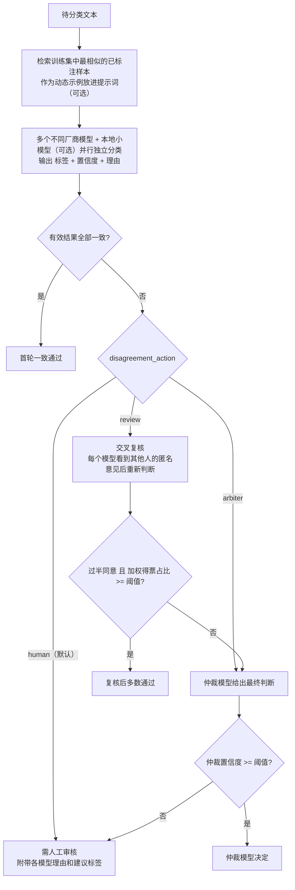

# CrossCheck：多模型互检分类

让多个大模型像多名标注员一样，对同一批文本**独立分类 → 一致即采纳 → 分歧交人工（可选交叉复核 / 仲裁）**，用模型之间的相互检查来提升分类准确率，并把真正困难的样本筛出来交给人。

提示词里会自动放入训练集中最相似的已标注样本（动态示例），还可以加入一个用训练集训练的本地小模型作为额外一票，让投票者的出错方式更独立。

> 当前版本是 **v0.1 基础实现**，已接入真实模型并完成实测；进阶能力见下方 [项目规划](#项目规划roadmap)。
>
> 图文版项目介绍（思路、流程、两次检验结果、路线图）：[`docs/index.html`](docs/index.html)，单文件、无外部依赖，下载后用浏览器直接打开。

---

## 为什么要互检

- **不同模型的分类标准和准确率不同**：同一条文本，GPT、Claude、DeepSeek、Qwen 可能给出不同答案。
- **单个模型的错误难以发现**：模型答错时往往依然“很自信”。
- **不同厂商模型的错误相对独立**：多个模型同时犯同一个错的概率远低于单个模型犯错的概率，因此“一致”本身就是一个很强的质量信号，“分歧”则是一个天然的难例探测器。

互检的本质是把众包标注领域成熟的方法（多数投票、交叉审核、仲裁、Dawid-Skene 聚合、人工复核）迁移到大模型上。

---

## 工作流程



几个关键设计：

| 设计 | 目的 |
|---|---|
| 统一的分类手册（定义 + 正反例 + 边界规则） | 让所有模型按同一套标准判断，减少“标准不一致”造成的分歧 |
| 动态示例：每条文本检索训练集中最相似的 k 条已标注样本 | 让模型学到该数据集自己的标注尺度，而不是按常识判断 |
| 本地小模型（TF-IDF + 逻辑回归）作为额外一票 | 与大模型出错方式不同，“全票一致”更可信 |
| 复核时隐去模型名、要求“理由更符合标准才修改” | 防止模型盲从多数或迎合强模型（sycophancy） |
| 加权投票（权重 × 置信度） | 准确率高的模型话语权更大，权重可由金标准自动计算 |
| 回复缓存 | 相同模型 + 相同提示词只调用一次，反复实验不重复付费 |
| mock 模式 | 没有 API key 也能跑通全流程 |

---

## 快速开始

### 1. 安装

```bash
pip install -r requirements.txt
```

Python 3.10+。

### 2. 网页平台（推荐）

```bash
streamlit run app.py
```

浏览器打开 <http://localhost:8501>。交给别人用时，把仓库地址发过去即可，不要发送 `.env`。对方如何安装、如何填写自己的密钥（百炼一把共用，或拆成各填各的）、六个页面怎么操作，写在 [`docs/guide.html`](docs/guide.html)，用浏览器直接打开。

六个页面：

| 页面 | 功能 |
|---|---|
| ① 模型配置 | 表格编辑模型（投票 / 仲裁 / 评审团、接口地址、模型名、限流、额外参数），填写 API Key（保存到本地 `.env`），一键测试连通性 |
| ② 分类任务 | 编辑类别定义、正反例、边界规则（可开启多标签、层级分类），预览发给模型的提示词；从标准文档或已标注数据自动生成标准草稿；标准体检；版本记录与恢复；新任务验证向导 |
| ③ 训练数据（可选） | 没有训练数据可以跳过。有已标注的同类数据时，上传文件或手动录入（追加 / 替换），开启“动态示例”和“本地小模型”；可输入一段文本试看检索结果 |
| ④ 运行与结果 | 普通文本、多轮对话或长文档。表格支持 CSV / Excel / JSONL；对话支持一行一句或一行一段；长文档支持 PDF / Word / 网页 / TXT，按章节和关键词筛选后逐段分类，并汇总成文档指标。运行前可预估费用。“🧪 高级”里可选校准文件、Self-Consistency、证据引用、多轮辩论、魔鬼代言人、评审团 |
| ⑤ 人工审核 | 逐条或表格批量审核。对话按聊天气泡显示并标出模型引用的句子；长文档显示所在章节、页码和相邻段落 |
| ⑥ 历史与对比 | 运行记录、载入配置、多次运行对比；在评估运行上比较聚合方式、校准置信度、按目标准确率找门槛；同一任务的漂移监控；根据分歧样本建议可追加的边界规则 |

**任务库（侧边栏）**

- 每个分类任务是一个配置文件，下拉框显示任务名；“➕ 新建分类任务”可以从空白开始或复制当前任务，新任务只保存与 `config.yaml` 不同的部分（模型配置自动继承，改一次 key 所有任务生效）
- 保存时自动记录分类标准版本（见下一节），可填写“本次修改说明”；类别改名或删减时提醒金标准可能需要重新审核

**分类任务页**

- **🪄 生成标准草稿**：三种来源——上传标准文档（Word / PDF / TXT / Markdown，最多 4 万字）、粘贴文字、已标注数据（每类抽若干条，让模型归纳各类别的定义和边界）；也可以“在当前标准基础上修改”。草稿显示与当前标准的逐条差异和模型的疑问，确认后才替换
- **🩺 标准体检**：让模型检查当前标准里的冲突、模糊、遗漏和示例错误，逐条给出修改建议
- **🕘 分类标准版本**：每次保存且标准有变化时存一个版本（`configs/versions/<任务>/`），显示各版本的修改说明和逐条差异，可一键恢复
- **✅ 验证向导**：新任务 / 改标准后的验证步骤、样本量与误差表、抽样工具、调参集 / 验证集分层划分工具（详见“[新任务与分类标准变化](#新任务与分类标准变化)”）

**训练数据页**

- **有没有训练数据是两种模式**：没有时，模型只按分类任务页的定义和规则判断，两个增强开关不可用；有时才能开启
- 训练数据保存为 `text,label` 两列的 CSV，默认放在 `data/train/`（已被 git 忽略，不会上传）；标签不在当前类别中的行会被跳过并提示
- 显示样本数、各类别样本量，提示缺样本或样本过少（< 30 条）的类别
- 评估时如果待评估数据和训练数据有重叠，运行页会提醒：本地小模型见过这些答案，准确率会偏高
- 人工审核页可以把审核过的样本直接追加进训练数据文件，越用越准

- **有标签列**：显示每个模型、多数投票、加权投票、互检系统的准确率卡片和对比表，5 张图表，逐条明细（判错标红）
- **无标签列**：显示模型两两一致率、各模型的类别分布、逐条结果
- 可下载结果 CSV、待人工审核 CSV、完整明细 JSONL、图表报告 HTML（单文件，图片已内嵌）
- 侧边栏可切换 / 保存配置文件

**人工审核页**

- **审核范围**：需人工审核的样本 / 首轮有分歧的全部样本 / 从首轮一致通过的样本中随机抽检 N 条 / 全部样本
- **逐条审核**：显示原文、各模型首轮与复核后的判断和理由、仲裁意见；每个类别标注得票数和“模型建议”；确认后立即存盘（`<运行目录>/<结果文件名>_reviews.json`），关闭浏览器不丢失
- **表格批量审核**：表格里直接选人工标签；“未填写的全部采用模型建议”适合抽检场景
- **审核统计**：在已审核样本上，互检系统和每个模型与人工判定的一致率，按处理环节的确认率
- **导出与回流**：下载合并人工结果的最终结果 CSV；把已审核样本追加到金标准文件（按文本去重），下次评估直接使用
- **对话和长文档**：对话按聊天气泡显示，模型理由里逐字引用到的句子会标出；长文档显示章节、页码，以及同一文档里的上一段和下一段

**对话和长文档**（运行页顶部切换）

- **多轮对话**：一行一句需要会话编号、角色、内容（可选时间和标签）；一行一段则整段写在一个单元格里，用“角色：内容”换行。可以给整段对话一个类别，或只判断某一句并带上前文。超长对话保留最近的内容。示例：`data/sample_dialogue.csv`、`data/sample_dialogue_block.csv`
- **长文档**：上传 PDF / Word / HTML / TXT（可多份）。自动识别“第 X 节”这类标题，丢掉目录、页眉和“本公司董事会保证……”这类套话。可用章节和关键词缩小范围。结果页按文档汇总各类段落数、占比；类别里同时有“积极/机遇”和“消极/风险”时给出净语调。示例：`data/sample_report.txt`
- 扫描版 PDF、按字段抽取年报信息、按股票代码下载年报，这几项还没有做。一段多个标签可以在分类任务页开启“多标签”

**多标签和层级分类**（分类任务页）

- **多标签**：一条文本可以同时属于几类，模型输出 `labels` 列表，每个标签单独投票（过半数模型选了才保留）。结果写成 `A|B`，按配置里的类别顺序排列；金标准可以写 `A|B`、`A;B`、`A，B`、`A、B`。评估额外给出完全一致率、micro-F1 和 Hamming 准确率；审核页改成多选
- **层级分类**：类别名写成 `一级/二级`（如 `投诉/物流`），提示词按一级类分组展示；首轮只在二级类有分歧时备注“一级类一致”，评估额外给出一级类准确率
- 两者不能和校准文件同时使用（校准按单标签统计混淆矩阵）

**校准与门槛**（历史页，选一次带标准答案的评估运行）

- **聚合方式对比**：每个模型、多数投票、按模型加权、按类别加权（混淆矩阵）、按类别加权 + 校准置信度、Dawid-Skene、Wawa、MACE、GLAD。需要标准答案的方法用 5 折交叉验证，避免“在考题上训练”，并推荐准确率最高的一种
- **置信度校准**：每个模型用 Platt 或保序回归（Isotonic）把自报置信度映射成真实正确率，两折交叉验证选更好的一种；原本 ECE < 0.05 的不再校准。表里给出校准前后的 ECE（期望校准误差，越小越好）
- **按目标准确率找门槛**：拖动目标准确率，给出推荐的后验概率门槛 `min_posterior`、覆盖率-准确率曲线，以及用这次运行记录模拟的 `accept_threshold` / `arbiter_threshold` 组合。达不到目标时显示能达到的最好结果
- **💾 保存校准文件并用于当前配置**：写到 `output/calibration/<任务>_<运行>.json`，并把 `calibration`、`min_posterior` 等写进当前配置。之后运行时，每个回答多一个校准后置信度；后验概率达到门槛的样本即使首轮有分歧也直接采纳，首轮一致但后验概率低的样本不再自动采纳
- 命令行：`python -m crosscheck calibrate output/xxx/eval.jsonl -c configs/xxx.yaml --target 0.9`

**高级协作选项**（运行页“🧪 高级”，默认全部关闭，关闭时提示词和缓存与之前完全相同）

| 选项 | 配置项 | 做什么 |
|---|---|---|
| Self-Consistency | `samples`、`sample_temperature`、`sample_models` | 同一模型再按较高温度采样几次，取多数答案，置信度 = 多数答案占比。本地小模型不采样 |
| 证据引用 | `require_evidence`、`evidence_penalty` | 要求模型逐字引用原文；引用在原文里找不到的判断，投票权重乘以系数 |
| 多轮辩论 | `debate_rounds` | 复核最多进行几轮，全体一致就提前停止 |
| 对照式复核 | `review_view` | 复核时看到他人的“结论 + 理由”（默认）、只看理由（理由里的类别名被遮盖）、只看结论 |
| 魔鬼代言人 | `devil_advocate` | 复核前先让一个模型专门反驳当前多数意见，反驳意见一并交给复核者 |
| 评审团 | 模型表中角色选“评审团”、`jury_threshold` | 多个模型各自仲裁，同意比例达到门槛才采纳，代替单个仲裁模型 |

**漂移监控和规则建议**（历史页底部）

- 同一分类任务的运行按时间排列，比较最近两次的人工比例、准确率和标签分布。人工比例升高 8 个百分点、准确率下降 5 个百分点，或标签分布的总变差达到 0.15，就会提示。两次用的分类标准不同时会说明，避免把改标准误当成数据漂移
- “根据分歧建议规则”把一次运行里模型意见不同的样本交给一个模型（优先千问），归纳边界并给出可以直接追加的规则。追加后还要在侧边栏保存才会写入文件。在股吧情绪的 12 条分歧上试过一次：建议覆盖反问式看多、用同行对比暗示低估、以及“割肉 / 被套”无论是否提问都归消极

**历史与对比页**

- 每次运行都会在结果旁边写一份 `<结果名>.meta.json`：时间、数据文件、备注、模型和策略、费用、完整配置快照（不含 key）；评估运行还会把真实标签写进结果明细。对话和长文档另外写一份 `<结果名>_extra.json`，供审核页还原原文结构
- **运行记录表**：按数据筛选，显示每次运行使用的分类标准版本、自动采纳比例、全自动 / 自动采纳 / 人工兜底后的准确率、每条的大模型调用次数、本次费用和“不计缓存费用”（公平比较不同方案的成本），备注可直接编辑
- **运行详情**：各模型准确率、调用与 token 统计、配置快照；“载入这次运行的配置”一键恢复当时的模型、类别定义、规则和策略，用于复现或在此基础上修改；可删除不需要的运行
- **多次运行对比**：在共同样本（按 id 匹配）上对比各项指标和各模型准确率；选一个基准运行做 McNemar 配对检验，判断差异是否只是随机波动；逐条对照表可只看结论不同或有运行判错的样本，并可下载。没有真实标签的运行可以选一个标签文件作为对照；所选运行的分类标准不同时，显示标准之间的逐条差异

### 3. 命令行：用 mock 模式跑通流程（不需要 API key）

```bash
python -m crosscheck classify data/sample.csv --mock
python -m crosscheck evaluate data/gold.csv --mock
```

### 4. 接入真实模型

在项目根目录新建 `.env` 文件写入 key（已被 `.gitignore` 忽略，不会上传），程序启动时自动加载：

```ini
DEEPSEEK_API_KEY=sk-...
DASHSCOPE_API_KEY=sk-...      # 阿里云百炼：千问、Kimi、GLM 都可以通过它调用
MOONSHOT_API_KEY=sk-...       # Kimi 官方（可选）
```

```bash
python -m crosscheck ping      # 逐个测试模型是否可用
```

当前默认配置：投票模型为 `deepseek-flash`（DeepSeek 官方）、`kimi-k2.6`（百炼）、`qwen3.7-plus`（百炼），仲裁模型为 `glm-5.3`（百炼，第四家厂商，不偏向任何投票方）。

接入时的常见坑（已在 `config.yaml` 中处理）：

- 新一代模型多数默认开启“思考模式”，分类任务建议通过 `extra_body` 关闭以提速（DeepSeek：`thinking: {type: disabled}`；百炼：`enable_thinking: false`）
- Kimi 官方接口不允许 `temperature=0`（思考模式只允许 1，非思考只允许 0.6）
- 新注册账号限额很低（例如 Kimi 官方并发 1、每分钟 3 次），可用 `max_concurrency` / `rpm` 限流

`provider` 支持三种：

| provider | 适用 |
|---|---|
| `openai` | 所有 OpenAI 兼容接口：OpenAI、DeepSeek、通义千问、Kimi、智谱、大部分中转平台 |
| `anthropic` | Anthropic 原生 `/v1/messages` 接口 |
| `mock` | 假模型，用于测试 |

### 5. 命令行推荐的使用顺序

```bash
# ① 在人工标注的金标准上评估，生成模型权重 output/weights.json
python -m crosscheck evaluate data/gold.csv

# ② 查看 output/eval_report.txt，根据判错样本修改 config.yaml 中的分类标准和边界规则，重复 ①

# ③ 正式分类（先用 --limit 试跑）
python -m crosscheck classify data/your_data.csv --weights output/weights.json --limit 50
python -m crosscheck classify data/your_data.csv --weights output/weights.json

# ④ （可选）无监督交叉验证：Dawid-Skene 估计每个模型的准确率
python -m crosscheck aggregate output/results.jsonl
```

---

## 新任务与分类标准变化

**能分什么**：任意“一段文本 → 一个（或几个）类别”的任务，类别可以分两级，类别和标准都写在配置文件里，代码和提示词模板不针对某个数据集。已实测过客服消息意图、新闻标题主题（15 类）、年报气候段落、FOMC 货币政策立场、股吧帖子情绪。运行页还可以直接导入多轮对话（整段或逐句），以及把 PDF / Word 年报切成段落后逐段分类。

**目前还不支持**：三级及以上的层级、把超长对话先摘要再分类、扫描版 PDF、按字段抽取年报里的具体事项、按股票代码自动下载年报。对话和普通年报 PDF 的逐段分类已经可以在运行页切换。

**哪些是通用的，哪些要按任务调**：流水线、投票、复核、仲裁、级联、费用统计、审核、历史对比都是通用的；每个任务需要自己的类别定义、正反例、边界规则，训练数据（动态示例、本地小模型）可选。实测里调出来的最佳策略（如“首轮不一致转人工”、“本地 + DeepSeek 级联”）在新任务上不一定最好，需要用下面的流程在新任务的金标准上重新验证。

**新任务 / 标准变化时的流程**：

1. **建任务**：侧边栏“➕ 新建分类任务”
2. **导入标准**：分类任务页“🪄 生成标准草稿”——有书面标准就上传文档，有人工标注过的数据就让模型从数据中归纳；再人工修改，用“🩺 标准体检”找冲突和模糊之处
3. **抽样试跑**：验证向导里从待分类数据抽 100~200 条，在运行页跑一遍
4. **人工标注**：审核页选“全部样本”逐条确认，加入金标准
5. **划分调参集 / 验证集**：只在调参集上反复改标准、看判错样本；验证集只在最后跑一次，得到的准确率才能代表新数据
6. **改标准 → 保存（自动存版本）→ 重跑 → 在历史页对比**：看准确率变化、McNemar 显著性和标准差异；未改动的提示词命中缓存不重复收费
7. **上线后定期抽检**：审核页抽检“首轮一致通过”的样本，人工改动率上升说明数据或口径变了

**样本量与误差**（95% 置信区间半宽，准确率 80% 时）：50 条 ±11.1、100 条 ±7.8、200 条 ±5.5、400 条 ±3.9、1000 条 ±2.5 个百分点。两个版本的差异小于误差范围时可能只是随机波动。

**分类标准版本**：`configs/versions/<配置文件名>/v<n>_<时间>.json`，内容是版本号、时间、标准哈希、修改说明和完整的 `task`。标准哈希只看类别定义、正反例和规则（不含 `shuffle_labels` 这类运行开关），运行记录里保存哈希和版本号，所以能知道每次运行用的是哪版标准。

---

## 命令说明

| 命令 | 作用 | 主要输出 |
|---|---|---|
| `classify <输入文件>` | 互检分类 | `results.csv`、`results.jsonl`、`results_need_human.csv` |
| `evaluate <金标准文件>` | 评估系统和每个模型的准确率，自动算权重 | `eval_report.txt`、`weights.json` |
| `aggregate <results.jsonl>` | Dawid-Skene 无监督聚合，无需标准答案即可估计各模型准确率 | `ds_results.csv` |
| `calibrate <eval.jsonl>` | 用一次评估运行比较聚合方式、校准置信度、按 `--target` 目标准确率推荐 `min_posterior` | `output/calibration.json`（`-o` 可改） |
| `evolve <eval.jsonl>` | 不调用模型：优先审核能抓住多少错、哪些标签可能标错。`--train` 再比较加进本地小模型的效果 | 控制台 |
| `optimize <金标准>` | 在调参集上搜索边界规则，留出集只评一次（会调用模型） | `output/optimize_report.txt` |
| `ping` | 测试所有模型 API 连通性 | 控制台输出 |

通用参数：`-c` 配置文件、`-o` 输出目录、`--mock`、`--text-col` / `--id-col` / `--label-col` 指定列名、`--weights` 加载权重、`--limit` 只处理前 N 条。

成本相关参数（`classify` / `evaluate`）：`--estimate-only` 只预估调用次数和费用、`--budget N` 预计费用超过 N 元时不运行、`--disagree-rate` 预估用的分歧比例（默认 0.25）、`--resume` 断点续跑、`--note` 本次运行的备注（显示在网页历史记录中）。

配置继承（`base`）时顶层字段整体覆盖；只想改一个嵌套字段时用带点的键，例如 `task.shuffle_labels: true`。

v0.4 / v0.5 新增的配置项（都可以在网页上设置，不写就是默认值）：

```yaml
task:
  multi_label: false        # 多标签
  max_labels: 3
  hierarchical: false       # 层级分类，类别名写成 一级/二级
pipeline:
  calibration: ""           # 校准文件路径
  min_posterior: 0          # 后验概率门槛，需要校准文件
  samples: 1                # Self-Consistency 每个模型的回答次数（1 = 不采样）
  sample_temperature: 0.7
  sample_models: []         # 只对这些模型采样，空 = 全部大模型
  require_evidence: false   # 证据引用
  evidence_penalty: 0.5
  debate_rounds: 1          # 复核最多几轮
  review_view: full         # full / reasons / labels
  devil_advocate: false
  jury_threshold: 0.6
jury:                       # 评审团成员，写法与 models 相同；需要 use_arbiter: true
  - {name: ..., provider: openai, model: ..., api_key_env: ...}
```

输入支持 `.csv`（UTF-8 / GBK 自动识别）和 `.jsonl`。

### 输出文件

- `results.csv`：每条样本的最终标签、处理状态、置信度，以及每个模型每一轮的判断，可直接用 Excel 打开。
- `results_need_human.csv`：需要人工处理的样本，附带建议标签和所有模型的理由，`human_label` 列留给人工填写。
- `results.jsonl`：完整明细（含模型原始回复），用于追溯和二次分析。

### 评估报告与图表

`evaluate` 会在输出目录生成 `report.html`（浏览器打开）和 `charts/` 下的 5 张图：

| 图 | 回答的问题 |
|---|---|
| `accuracy.png` | 每个模型单独的准确率 vs 多数投票 vs 加权投票 vs 完整互检，以及最佳单模型和理论上限参考线 |
| `per_class.png` | 每个类别上哪个模型更强 |
| `review.png` | 交叉复核前后每个模型的准确率变化 |
| `status.png` | 样本在各环节（首轮一致 / 复核通过 / 仲裁 / 人工）的去向和各环节准确率 |
| `confusion.png` | 互检系统的混淆矩阵 |

报告中还有逐条明细表，判错的格子标红。

### 评估指标

- **单模型准确率**（首轮 / 复核后）：衡量每个模型的能力，以及交叉复核是否带来提升。
- **自动采纳比例 & 自动采纳准确率**：系统能替代多少人工，以及替代部分有多可靠。
- **按状态分组的准确率**：通常“首轮一致通过”最可靠，可据此决定哪些状态需要抽检。
- **Fleiss' Kappa**：模型间一致性。过低通常说明分类标准本身有歧义。
- **混淆矩阵**：哪两个类别最容易混淆，是修订边界规则的直接依据。

---

## 实测结果（2026-09）

投票模型 DeepSeek / Kimi / 千问，仲裁模型 GLM。

**客服消息 5 分类**（`data/gold.csv`，60 条，自编，边界规则清晰）

```bash
python -m crosscheck evaluate data/gold.csv -o output/service
```

三个模型均为 100%，Kappa = 1.0。说明：**标准清晰、任务简单时，现代大模型之间几乎没有分歧，互检只起确认作用**。

**新闻标题 15 分类**（`data/tnews_gold.csv`，CLUE TNEWS 验证集分层抽样 150 条）

```bash
python -m crosscheck evaluate data/tnews_gold.csv -c configs/tnews.yaml -o output/tnews
```

| 方案 | 准确率 |
|---|---|
| deepseek-flash | 56.7% |
| kimi-k2.6 | 55.3% |
| qwen3.7-plus | 58.0% |
| 多数投票 | 55.3% |
| 加权投票 | 55.3% |
| 互检系统（复核 + 仲裁） | 57.3% |
| 理论上限（任一模型答对） | 63.3% |

关键发现：

1. **模型错误高度相关**（Kappa = 0.85），投票能提升的空间只有理论上限与最佳单模型之间的 5 个百分点。TNEWS 标签来自头条频道，本身噪声较大，也压低了上限。
2. **“首轮是否一致”是极强的质量信号**：首轮三家一致的 119 条准确率 64.7%，有分歧的 31 条只有 29%。
3. **交叉复核存在“从众收敛”**：分歧样本复核后多数变成三家一致，但一致后的准确率仍只有 24%。因此对这类任务，**首轮分歧本身就应该触发人工或仲裁**，而不是看复核后是否一致。

> TNEWS 数据来自 [CLUE Benchmark](https://github.com/CLUEbenchmark/CLUE)。

### 经济 / 金融文本分类（3 个公开数据集）

```bash
python scripts/prepare_econ.py      # 下载数据，每类分层抽 50 条测试集，训练集短样本作为提示词示例
python -m crosscheck evaluate data/econ_climate_gold.csv -c configs/econ_climate.yaml -o output/econ_climate
python -m crosscheck evaluate data/econ_fomc_gold.csv    -c configs/econ_fomc.yaml    -o output/econ_fomc
python -m crosscheck evaluate data/econ_finfe_gold.csv   -c configs/econ_finfe.yaml   -o output/econ_finfe
```

| 任务（经济学领域） | 数据集 | deepseek | kimi | qwen | 多数投票 | 互检系统 | 理论上限 | 首轮一致 / 分歧的准确率 |
|---|---|---|---|---|---|---|---|---|
| 年报气候段落：风险/机遇/中性（ESG、气候金融） | [ClimateBERT climate_sentiment](https://huggingface.co/datasets/climatebert/climate_sentiment) | 79.3% | 83.3% | **86.0%** | 84.7% | 83.3% | 92.0% | 91.5% / 53.1% |
| FOMC 句子：鹰派/鸽派/中性（货币经济学） | [Trillion Dollar Words](https://huggingface.co/datasets/gtfintechlab/fomc_communication) | **65.3%** | 62.0% | 60.7% | 61.3% | 62.0% | 73.3% | 69.6% / 37.1% |
| 股吧帖子：积极/消极/中性（行为金融、投资者情绪） | [BBT-FinCUGE FinFE](https://github.com/supersymmetry-technologies/BBT-FinCUGE-Applications) | **70.0%** | 68.0% | 67.3% | 68.0% | 68.7% | 79.3% | 75.2% / 45.5% |

结论与 TNEWS 一致：投票不稳定地超过最佳单模型（Kappa 0.76–0.79，错误高度相关），但**首轮一致的约 78% 样本准确率明显更高，分歧的约 22% 是人工复核最该看的部分**。FOMC 的主要错误是把“描述经济强劲”的鹰派句判为中性，这类数据集的标注规则（见 `configs/econ_fomc.yaml`）比常识更严格；FinFE 中有不少反讽和标注噪声（如“今天能涨停算我输”被标为中性）。

#### 改进实验：动态示例 + 本地小模型 + 分歧转人工

上表暴露的问题：三个大模型错误高度相关，交叉复核改对 13 条、改错 10 条（600 条金标准中的 131 条分歧样本），几乎没有净收益。为此做了三项改进，并在同样的 450 条金标准上对比：

1. **动态示例**（`fewshot`）：对每条文本，用字符级 TF-IDF 从训练集检索最相似的 6 条已标注样本放进提示词。训练集已剔除与测试集重复的文本。
2. **本地小模型**（`provider: local`）：用训练集训练 TF-IDF + 逻辑回归分类器，作为第 4 票。它单独的准确率不高（58%–73%），但出错方式与大模型不同。
3. **分歧直接转人工**（`disagreement_action: human`，现为默认）。

```bash
python scripts/prepare_econ.py      # 同时生成 data/econ_*_train.csv
python -m crosscheck evaluate data/econ_fomc_gold.csv -c configs/econ_fomc_fewshot.yaml -o output/econ_fomc_fewshot
python -m crosscheck evaluate data/econ_fomc_gold.csv -c configs/econ_fomc_hybrid.yaml  -o output/econ_fomc_hybrid
python scripts/compare_econ.py      # 输出三个版本的对比 output/econ_compare.txt
```

**全自动准确率**（不用人工，分歧样本取加权投票结果）：

| 数据集 | 基线 | 动态示例 | 动态示例 + 本地小模型 |
|---|---|---|---|
| 年报气候段落 | 83.3% | 85.3% | **86.0%** |
| FOMC 鹰鸽 | 62.0% | 65.3% | **66.0%** |
| 股吧情绪 | 68.7% | **72.0%** | 70.7% |
| 平均 | 71.3% | **74.2%** | **74.2%** |

动态示例让 9 个“模型 × 数据集”组合中的 8 个提升（最多 +4.7pp），平均 +2.9pp。单个数据集 150 条的 95% 置信区间约 ±7.7pp，所以单看一个数据集的差异不显著，但三个数据集方向一致。

**人机协作**（一致的自动采纳，其余交人工，假设人工判对）：

| 数据集 | 基线：三模型一致 | 混合：四票全一致 |
|---|---|---|
| 年报气候段落 | 自动 78.7%，准确率 91.5% → 整体 93.3% | 自动 62.7%，准确率 **95.7%** → 整体 **97.3%** |
| FOMC 鹰鸽 | 自动 76.7%，准确率 69.6% → 整体 76.7% | 自动 54.7%，准确率 **74.4%** → 整体 **86.0%** |
| 股吧情绪 | 自动 78.0%，准确率 75.2% → 整体 80.7% | 自动 53.3%，准确率 **86.2%** → 整体 **92.7%** |
| 平均 | 自动 77.8%，准确率 78.8% → 整体 83.6% | 自动 56.9%，准确率 **85.4%** → 整体 **92.0%** |

结论：

- **动态示例是稳定有效、几乎零成本的改进**，应默认开启（只要有训练集或历史标注）。
- **本地小模型的价值不在于多一票，而在于让“一致”更可信**：自动采纳部分的准确率从 78.8% 提高到 85.4%，代价是人工比例从 22% 升到 43%。可按预算选择策略：`compare_econ.py` 同时给出“四票至少三票”等折中方案（自动采纳约 90%，准确率约 79%）。
- **FOMC 的上限主要受标注尺度限制**：四票全一致仍判错的 21 条中，16 条是金标准为鹰派/鸽派、所有模型都判为中性，例如“匈牙利和波兰采用了通胀目标制”被标为鹰派。这类数据集需要更多体现标注习惯的示例，或者直接接受人工复核。

> 数据集许可：climate_sentiment 为 CC BY-NC-SA 4.0，Trillion Dollar Words 为 CC BY-NC 4.0，仅用于非商业研究。

#### 成本：费用预估、级联调用、断点续跑

**费用统计**：在 `config.yaml` 每个模型下填 `price_in` / `price_out`（元 / 百万 token，按官网价格）。运行结束后按模型显示实际请求数、缓存命中、接口返回的输入 / 输出 token、本次费用和缓存节省的费用；没填单价的模型只统计 token。

**运行前预估**：首轮提示词逐条构造并查缓存，缓存命中的不计费；后续环节取决于模型是否一致，给出“最少（全部一致）/ 预计（按分歧比例，默认 25%）/ 最多（全部分歧）”三档。

```bash
python -m crosscheck classify data/your_data.csv --estimate-only    # 只预估，不调用
python -m crosscheck classify data/your_data.csv --budget 5         # 预计费用超过 5 元就不运行
python -m crosscheck classify data/your_data.csv --resume           # 中断后续跑，跳过已完成的样本
```

**断点续跑**：每处理完一条就追加写入 `<输出目录>/<结果名>.checkpoint.jsonl`，`--resume` 时跳过已完成样本，全部完成后自动删除检查点。不加 `--resume` 时如果发现旧检查点会提示并从头开始。

**级联调用**（`pipeline.cascade`）：先只调用列出的模型（至少 2 个，少于全部投票模型）；它们全部一致就直接采纳，其余模型不再调用；不一致才调用其余模型，按正常流程投票。推荐 `cascade: [local, deepseek]`：本地小模型免费，DeepSeek 最便宜，两者出错方式不同，一致时相当可信。

在 200 条**从未用于调参的新股吧帖子**上实测（FinFE 训练集外、金标准外的样本，`configs/econ_finfe_cascade.yaml` vs `configs/econ_finfe_hybrid.yaml`）：

| 方案 | 实际费用 | 每千条 | 自动采纳 | 自动采纳准确率 | 人工兜底后 |
|---|---|---|---|---|---|
| 三个大模型全一致（原做法） | 1.65 元 | 8.3 元 | 82.5% | 81.2% | 84.5% |
| 四票全一致（混合） | 1.65 元 | 8.3 元 | 66.5% | **89.5%** | **93.0%** |
| 级联：本地 + DeepSeek 一致即采纳 | **0.66 元** | **3.3 元** | 73.5% | 87.8% | 91.0% |

- 级联只有 26.5% 的样本需要调用 Kimi 和千问，**费用降到四票方案的 40%**，人工量更少，准确率只低 2 个百分点，且明显好于原来的“三个大模型全一致”
- 在 450 条金标准上离线模拟结论一致：级联的大模型调用量为全量的 53%–60%，人工兜底后准确率 92.7% / 83.3% / 90.7%（年报气候 / FOMC / 股吧），四票全一致为 97.3% / 86.0% / 92.7%。对准确率要求最高时用四票全一致，费用敏感时用级联
- **预估准确度**：token 估算系数已按三家接口返回的实际用量校准，按实际分歧比例预估，级联 0.688 元 vs 实际 0.664 元，四票 1.702 元 vs 实际 1.651 元，误差 4% 以内

#### 置信度级联、logprobs 与选项顺序随机化

```bash
python -m crosscheck evaluate data/econ_finfe_gold.csv -c configs/econ_finfe_shuffle.yaml -o output/econ_finfe_shuffle
```

`configs/econ_*_shuffle.yaml` 在混合版基础上开启选项顺序随机化，并让千问、Kimi 返回 logprobs。三个数据集共 450 条，实际花费 5.17 元。

**1. 选项顺序随机化没有显著效果。** 开启后每个模型、每条文本看到的类别顺序不同。三个大模型的准确率变化都在 ±0.6 个百分点以内（McNemar p ≥ 0.68）；模型选中第 1 / 2 / 3 个选项的比例（如 DeepSeek 34.4% / 34.0% / 31.6%）与真实答案所在位置的比例（34.4% / 32.2% / 33.3%）几乎一样，即 3 个类别时现代模型没有可测到的位置偏好。所以默认不开启；类别很多（如 15 类新闻）时可以开启检验。

**2. logprobs 比自报置信度更能区分对错，但大多饱和。** 用 AUROC 衡量置信度区分“判对 / 判错”的能力（0.5 = 没有区分度）：

| 模型 | 自报置信度 | logprobs 概率 | 说明 |
|---|---|---|---|
| deepseek | **0.751** | — | 温度 0 时 logprobs 只有 0 / 1，不可用；自报置信度反而最好 |
| kimi | 0.690 | **0.727** | 64% 的样本概率 ≥ 0.99 |
| qwen | 0.691 | **0.766** | 70% 的样本概率 ≥ 0.99，门槛要设到 0.999 这类很高的值 |
| local（本地小模型） | 0.720 | — | 预测概率，取值连续 |

**3. 置信度门槛是“费用 ↔ 准确率”的旋钮，但“两个不同类型的模型一致”比任何单个模型的置信度都更可靠。** 450 条上的模拟（首批不通过的样本调用全部模型，四票全一致才采纳，否则转人工）：

| 策略 | 大模型调用 / 条 | 费用 / 千条 | 自动采纳 | 人工兜底后 |
|---|---|---|---|---|
| 不级联：四票全一致 | 3.00 | 11.8 元 | 58.4% | **90.9%** |
| 本地 + DeepSeek 一致（`cascade_min_confidence: 0`） | **1.70** | **5.6 元** | 64.9% | 88.9% |
| 本地 + DeepSeek 一致且置信度 ≥ 0.6 | 2.11 | 7.5 元 | 61.6% | 89.8% |
| 本地 + DeepSeek 一致且置信度 ≥ 0.8 | 2.53 | 9.6 元 | 58.7% | 90.7% |
| 只问千问，logprobs ≥ 0.999 | 1.84 | 6.3 元 | 69.8% | 88.0% |
| 只看本地小模型，概率 ≥ 0.8 | 2.21 | 8.7 元 | 61.1% | 88.9% |

- 追求最低成本：`cascade: [local, deepseek]`，门槛 0；准确率要求高：门槛 0.8，费用约为不级联的 81%，准确率只差 0.2 个百分点
- 单模型级联（只问一个模型，置信度够高就采纳）在同等费用下基本都不如“本地 + DeepSeek 一致”：单个模型自信地答错的情况太多，而两个出错方式不同的模型同时答错的概率低得多

#### 自动归纳的分类标准 vs 手写标准

```bash
python -m crosscheck evaluate data/econ_finfe_gold.csv -c configs/econ_finfe_drafted.yaml -o output/econ_finfe_drafted
```

`configs/econ_finfe_drafted.yaml` 的类别定义、正反例和规则由千问从股吧训练集每类抽 25 条自动归纳（网页“🪄 生成标准草稿 → 已标注数据”），未经人工修改；与手写标准（`econ_finfe.yaml`）用同样的三个大模型、都不带动态示例，在 150 条金标准上比较：

| 分类标准 | DeepSeek | Kimi | 千问 | 三票多数 |
|---|---|---|---|---|
| 手写 | 70.0% | 68.0% | 67.3% | 68.7% |
| 自动归纳 | 66.0% | 71.3% | 72.0% | 72.0% |

- 差异都不显著（McNemar p = 0.07 / 0.33 / 0.07），即**自动归纳的标准与手写标准水平相当**，可以作为新任务的起点，省去从零写标准的时间。归纳一次只调用一次模型（约 1 分钟），150 条评估花费 1.76 元
- 归纳出的标准会暴露数据集自己的口径，例如“单纯的‘买入’指令标为中性”、“嘲讽别人但没表明自己立场标为中性”，这些正是手写标准容易漏掉、模型又容易判错的地方
- “🩺 标准体检”对手写标准指出了 5 个问题，其中“中性”类的一个正例“……这些拖真可以”本身带明显负面情绪（数据集标为中性），属于示例选得不好；以及“对自身持仓的情绪优先于对大盘的评论”这条规则难以执行
- 从一段文字说明（电商客服五类口径）生成标准：五个类别的定义、正反例和三条边界规则都完整，并指出了原文“看用户最主要想要什么”缺少判断依据

#### v0.4 聚合与校准（在已有的 18 次评估运行上离线验证，不花钱）

需要标准答案的方法都用 5 折交叉验证：在 4/5 的样本上估计混淆矩阵和校准曲线，在剩下 1/5 上计分。

**置信度校准有效**：大模型自报的置信度普遍比实际准确率高 10–35 个百分点，校准后 ECE 从 0.06–0.36 降到 0.03–0.14。例如千问在 FOMC 上平均置信度 91.5%、实际准确率 65.3%，ECE 0.304 → 0.060；在 TNEWS 上 0.361 → 0.074。本地小模型的概率本来就比较准（ECE 约 0.04），不再校准。

**聚合方式差别很小**：

| 运行 | 多数投票 | 按类别加权 | 按类别加权 + 校准置信度 | 其他方法中最好的 |
|---|---|---|---|---|
| 股吧情绪 + 本地小模型 | 70.7% | **73.3%** | 72.7% | — |
| FOMC + 本地小模型 | 66.0% | 68.0% | **68.7%** | — |
| FinFE 新测试集 200 条 + 本地 | 77.0% | 76.0% | **78.0%** | — |
| 股吧情绪（三个大模型） | **68.0%** | 67.3% | 66.7% | — |
| 年报气候段落 + 动态示例 | 85.3% | 85.3% | 85.3% | Dawid-Skene 86.0% |
| TNEWS 15 类 | 55.3% | **56.7%** | 54.0% | — |

差异都在 3 个百分点以内，小于 150 条样本的误差范围（约 ±7.7pp），Wawa / MACE / GLAD 与多数投票基本持平。原因和前面一样：几个大模型错误高度相关，怎么加权都救不回“大家一起错”的样本。

**真正有用的是“按后验概率决定自动采纳哪些”**：与“首轮全部一致才自动采纳”相比，在自动采纳比例相同的前提下，按校准后的后验概率挑样本：

| 运行 | 自动采纳比例 | 全部一致才采纳 | 按后验概率采纳 |
|---|---|---|---|
| 股吧情绪 + 本地小模型 | 53% | 86.3% | **90.0%** |
| 股吧情绪 + 本地 + 顺序随机化 | 56% | 83.3% | **89.3%** |
| FOMC + 本地小模型 | 55% | 74.4% | **78.0%** |
| FOMC + 本地 + 顺序随机化 | 54% | 75.3% | **79.0%** |
| 年报气候 + 本地 + 顺序随机化 | 65% | 92.9% | **96.9%** |
| 年报气候 + 本地小模型 | 63% | 95.7% | 95.7% |
| FinFE 新测试集 + 本地 | 67% | 89.5% | 88.7% |
| 只有三个大模型（股吧 / FOMC / TNEWS） | 78–79% | 75.2% / 69.6% / 64.7% | 73.5% / 68.7% / 61.3% |

- 投票者里有本地小模型（出错方式不同）时，多数运行提高 3.6–6.0 个百分点；只有三个相似的大模型时没有帮助，15 类的 TNEWS 每类样本太少，反而变差
- 目标准确率定得太高时常常达不到：FOMC 上后验门槛 0.99 也只有 85% 准确率（覆盖 31%），网页会显示能达到的最好结果，而不是假装达到
- 建议：有本地小模型或多种出错方式不同的投票者时，用 150 条以上的金标准做一次校准，再按目标准确率设 `min_posterior`；只有几个大模型时保持“首轮一致才采纳”即可

#### v0.5 协作模式（股吧情绪 150 条，真实调用）

投票模型 DeepSeek / Kimi / 千问，每个方案只改一个选项，其余与 `econ_finfe.yaml` 相同。首轮有分歧的 33 条上，首轮多数投票的准确率 42.4%。仲裁和评审团用的是 DeepSeek 以及三家各一份，没有用 GLM。9 个方案合计 3.42 元（除证据引用和采样两个方案外，首轮都命中缓存）。

| 方案 | 分歧样本准确率 | 改对 / 改错 | 复核后全体一致 | 全部 150 条 | 本次费用 |
|---|---|---|---|---|---|
| 复核 1 轮（原来的做法） | 45.5% | 2 / 1 | 20/33 | 68.7% | 0.02 元 |
| 辩论最多 3 轮 | 42.4% | 1 / 1 | 27/33 | 68.0% | 0.20 元 |
| 魔鬼代言人 | 42.4% | 3 / 3 | 20/33 | 68.0% | 0.40 元 |
| 复核只看理由 | 48.5% | 3 / 1 | 22/33 | 69.3% | 0.31 元 |
| 复核只看结论 | 48.5% | 2 / 0 | 17/33 | 69.3% | 0.30 元 |
| 单个仲裁（DeepSeek） | 48.5% | 3 / 1 | — | 69.3% | 0.05 元 |
| 评审团（三家各仲裁一次） | 45.5% | 2 / 1 | — | 68.7% | 0.24 元 |

- **没有一个方案有显著提升**：最好的也只比首轮多数多对 2 条（33 条样本，远在误差范围内）
- **多轮辩论只增加“一致”，不增加“正确”**：3 轮后 27/33 条全体一致，准确率反而没变，和前面看到的“从众收敛”一样。所以辩论后的“一致”不能当作可靠信号
- **魔鬼代言人改对 3 条也改错 3 条**：反驳意见确实能动摇多数，但动摇的方向不分对错
- **对照式复核略好于看完整意见**：只看理由或只看结论都比看“结论 + 理由”多对 1 条、改错更少，符合“减少锚定”的预期，但差距太小，不能下结论
- **评审团不如单个仲裁**：这里评审团成员就是三个投票模型本身，它们本来就意见不同，再投一次票并没有新信息；评审团要换成与投票者不同的模型才有意义
- **证据引用**（1.14 元）：三个模型几乎都能逐字引用原文（450 个回答里只有 3 个引用对不上），在股吧这种短文本上起不到筛选作用，准确率 68.0% 不变。长文本、年报段落上可能更有用
- **Self-Consistency**（DeepSeek 和千问各采样 3 次，0.77 元）：单模型准确率各提高约 0.7 个百分点；但“3 次答案是否一致”区分对错的能力（AUROC 0.49–0.56）不如模型自报的置信度（0.71–0.74），因为非思考模式下多次采样的答案很少变化

结论：这类“标注本身有噪声、模型错误高度相关”的任务，在分歧样本上继续让大模型讨论收益很小，**分歧样本交给人工仍是最划算的做法**；这些选项保留为开关，换到其他任务时可以用同样的方法在金标准上验证。

#### v0.6 闭环（人工回流、向量检索、主动学习、可疑标签、规则搜索）

**人工审核可以写回训练集**（训练数据页打开“自动入库”，默认关）。确认一条，就按文本写入 `fewshot.path`：新文本追加，标签变了就更新，没变不重写文件。下次分类的动态示例和本地小模型会用上这些人工标签。多标签任务不自动写入。

**向量检索比字符检索更接近标准答案。** 用百炼 `text-embedding-v4`（512 维，和千问同一把密钥）把训练集和待分类文本变成向量，取最相似的 6 条，看它们的多数标签是否等于标准答案。字符 n-gram 是原来的做法。向量缓存在本机，相同文本不重复计费。

| 数据集 | 字符检索 | 向量检索 |
|---|---|---|
| 股吧情绪（训练集 10550） | 47.3% | **59.3%** |
| FOMC（训练集 1925） | 56.0% | **64.7%** |
| 年报气候（训练集 1000） | 70.0% | **72.7%** |

这还不是大模型分类的准确率，只说明放进提示词的例子更靠谱。三次合计约 1.4 万条向量，接口返回的用量约 0.09 元（股吧 17.3 万 token），之后再跑命中缓存。默认仍是字符检索，在训练数据页切换。

**优先审核能少看一些却抓住更多错。** 按“模型之间是否分歧、置信度低不高”排序，太相似的文本往后放。只审前 20 条时，抓住的系统判错和随机抽 20 条的期望：

| 运行 | 判错总数 | 前 20 条抓住 | 随机期望 |
|---|---|---|---|
| 年报气候 | 25 | 12（48%） | 3.3 |
| 年报气候 + 本地小模型 | 21 | 9（43%） | 2.8 |
| 股吧 + 本地小模型 | 44 | 14（32%） | 5.9 |
| TNEWS | 64 | 16（25%） | 8.5 |
| 股吧情绪 | 47 | 10（21%） | 6.3 |
| FOMC | 57 | 11（19%） | 7.6 |

三个模型时，这个排序和“先看有分歧的”几乎一样，因为没把握的就是有分歧的。把这 20 条的标准答案加进本地小模型再训练：年报气候上，其余样本的准确率比随机加 20 条高大约 5–8 个百分点；FOMC 上几乎没有差别。审核页的范围里选“优先标注”。

**可疑标签是给金标准复查用的，不是自动改标。** 至少两个模型以不低于 0.75 的平均置信度同意另一个标签，就列出来。把客服数据里 8 条改错的标签全部找了出来（客服本身三个模型全对，所以本来一条都不会列）。股吧上列出 45 条，靠前的几条里有“还亏 93 万”“简直是无耻”却标成中性，和以前看到的标注噪声一致。FOMC 上 57 个判错里列出了 54 个，那里更多是模型没学会数据集的尺度，不能当成标错。所以这份名单要人看。

**规则搜索要看留出集，不能看调参集。** 在股吧 36 条上让千问根据判错样本提了两套新规则，只在 24 条调参集上挑选，12 条留出集只评一次（思路和 DSPy 的指令提案一样，没有引入 dspy）。当前规则在调参集上 66.7%、留出集 83.3%；选中的新规则调参集 79.2%，留出集仍是 83.3%。调参集上的提升没有带到留出集，规则没有写入配置。费用 0.42 元（当前规则命中缓存）。历史页可以自己再跑，胜出后需要手动替换规则。

---

## 项目结构

```
├── app.py                   # Streamlit 网页平台
├── config.yaml              # 分类任务、模型、阈值配置（换任务只需改这里）
├── configs/
│   ├── tnews.yaml           # 新闻分类任务（base 继承 config.yaml 的模型配置）
│   ├── econ_climate.yaml    # 年报气候段落 风险/机遇/中性
│   ├── econ_fomc.yaml       # FOMC 货币政策 鹰派/鸽派/中性
│   ├── econ_finfe.yaml      # 股吧帖子情绪 积极/消极/中性
│   ├── econ_*_fewshot.yaml  # 上述任务 + 动态示例 + 分歧转人工
│   ├── econ_*_hybrid.yaml   # 再加本地小模型作为第 4 票（含模型单价）
│   ├── econ_*_cascade.yaml  # 混合版 + 级联：本地小模型和 DeepSeek 一致即采纳
│   ├── econ_*_shuffle.yaml  # 混合版 + 选项顺序随机化 + 千问 / Kimi 读取 logprobs（实验用）
│   ├── econ_finfe_drafted.yaml  # 股吧情绪：分类标准由模型从训练集自动归纳（实验用）
│   └── versions/            # 分类标准的历史版本（保存时自动生成）
├── scripts/
│   ├── prepare_econ.py      # 下载经济金融数据集，生成金标准和训练集
│   └── compare_econ.py      # 对比基线 / 动态示例 / 混合投票三个版本
├── .env                     # API key（自行创建，不上传）
├── requirements.txt
├── data/
│   ├── gold.csv             # 客服消息金标准（60 条）
│   ├── tnews_gold.csv       # TNEWS 新闻标题金标准（150 条）
│   ├── econ_*_gold.csv      # 三个经济金融数据集金标准（各 150 条）
│   ├── econ_*_train.csv     # 对应训练集（已剔除测试集文本），用于动态示例和本地小模型
│   └── sample.csv           # 示例待分类数据
└── crosscheck/
    ├── cli.py               # 命令行入口
    ├── config.py            # 配置加载与校验
    ├── llm.py               # 模型调用层：OpenAI 兼容 / Anthropic / 本地小模型 / mock，含重试
    ├── local_model.py       # 相似样本检索（动态示例）与 TF-IDF + 逻辑回归本地分类器
    ├── prompts.py           # 首轮 / 复核 / 仲裁 / 魔鬼代言人提示词（动态示例、证据、多标签、层级）
    ├── embed.py             # 向量检索与向量缓存
    ├── evolve.py            # 主动学习排序、可疑标签
    ├── optimize.py          # 在调参集上搜索边界规则
    ├── classifier.py        # 结果解析、标签纠错、回复缓存、token 与费用统计
    ├── cost.py              # token 估算、运行前费用预估
    ├── pipeline.py          # 互检流水线
    ├── aggregate.py         # 加权投票、多标签投票、Dawid-Skene、Wawa、MACE、GLAD
    ├── calibrate.py         # 置信度校准、按类别加权（混淆矩阵）、聚合方式对比、门槛搜索
    ├── evaluate.py          # 评估指标与权重计算
    ├── report.py            # 图表与 HTML 报告
    ├── review.py            # 人工审核：审核范围、存盘、统计、回流金标准
    ├── history.py           # 运行记录、多次运行对比、McNemar 检验
    ├── criteria.py          # 分类标准的哈希、版本保存与逐条差异
    ├── drafting.py          # 读取标准文档，从文档 / 已标注数据生成标准草稿，标准体检
    ├── validation.py        # 抽样、调参集 / 验证集分层划分、样本量误差
    ├── dialogue.py          # 多轮对话：合并会话、整段 / 逐句、超长截取
    ├── documents.py         # 长文档：解析、章节切分、筛选、文档级汇总
    ├── monitor.py           # 分歧上的规则建议、多次运行的漂移检测
    └── io_utils.py          # 数据读写
```

---

## 项目规划（Roadmap）

### ✅ v0.1 基础实现（当前）

- [x] 配置驱动：类别定义、正反例、边界规则、模型、阈值全部写在 `config.yaml`
- [x] 多模型并行独立分类，结构化 JSON 输出与容错解析
- [x] 交叉复核（匿名意见 + 防盲从提示）
- [x] 加权投票 → 仲裁模型 → 人工兜底 的分层决策
- [x] 金标准评估：单模型准确率、Fleiss' Kappa、混淆矩阵、log-odds 自动权重
- [x] Dawid-Skene 无监督聚合
- [x] 回复缓存、并发控制、失败重试、mock 模式
- [x] 接入 DeepSeek / Kimi / 千问 / GLM 真实模型，`.env` 管理 key，单模型并发与 RPM 限流
- [x] 评估报告：单模型 vs 多数投票 vs 加权投票 vs 互检系统 准确率对比图、分类别对比、复核效果、混淆矩阵、HTML 报告
- [x] 配置继承（`base`），同一套模型配置复用于多个分类任务

### ✅ v0.2 Web 平台

目标：不写命令也能用，上传文件即可得到带图表的结果。

- [x] 在页面上配置模型：填写 API key / 接口地址 / 模型名，一键测试连通性
- [x] 在页面上编辑分类任务：类别、定义、正反例、边界规则
- [x] 上传 CSV / Excel，选择文本列和标签列，实时显示进度
- [x] 结果页：各模型准确率与投票准确率对比图、分类别对比、分歧样本列表，支持下载结果
- [x] 按实测结论新增策略开关：“首轮不一致即直接仲裁 / 转人工”（`pipeline.disagreement_action`）
- [x] 人工审核页：逐条 / 批量处理“需人工审核”样本，抽检一致样本，结果回流为金标准
- [x] 历史运行记录：网页和命令行的每次运行都记录时间、数据、方案、准确率、费用和配置快照，可一键载入配置复现
- [x] 多次运行对比：共同样本上的指标与各模型准确率、McNemar 显著性检验、逐条差异

### ✅ v0.3 成本与稳定性

目标：同等准确率下把成本降到 1/3 以下，并能稳定跑十万级数据。

- [x] **级联调用（Cascade）**：先调用本地小模型和最便宜的大模型，两者一致直接采纳，不一致才启动其余模型。实测费用降到 40%，准确率只低 2 个百分点
- [x] **断点续跑**：按样本增量写检查点，`--resume` 跳过已完成样本
- [x] **分模型限流**：每个模型独立的并发数和 RPM 限制（TPM 限制暂未做）
- [x] **Token 与费用统计**：按模型统计接口返回的输入 / 输出 token、费用和缓存节省
- [x] **运行前费用预估与预算上限**：命令行 `--estimate-only` / `--budget`，网页“预估调用次数和费用”按钮
- [x] **输出容错**：模型在理由里写未转义的双引号导致 JSON 不合法时，逐字段提取标签
- [x] **置信度级联**：`cascade_min_confidence` 要求首批模型一致且置信度达标才采纳（可只用 1 个模型），在“费用 ↔ 准确率”之间连续调节
- [x] **选项顺序随机化**：`task.shuffle_labels`，按模型和文本哈希固定顺序。实测 3 个类别时没有位置偏好，默认关闭
- [ ] **Excel 输出**、单元测试与 CI（网页已支持 Excel 输入）

### ✅ v0.3.1 任务库与分类标准管理

目标：换数据、换任务、改口径时不需要改代码，并且能验证改动是否有效。

- [x] **任务库**：侧边栏新建 / 复制分类任务，只保存与 `config.yaml` 不同的部分，模型配置自动继承
- [x] **导入分类标准**：上传 Word / PDF / TXT 标准文档或粘贴文字，由模型整理成类别定义、正反例和边界规则的草稿，列出原文不清楚的地方
- [x] **从已标注数据归纳标准**：每类抽若干条已标注样本，让模型归纳定义和边界。实测在股吧情绪上与手写标准水平相当
- [x] **标准体检**：检查冲突、模糊、遗漏和示例错误，逐条给出修改建议
- [x] **分类标准版本**：保存时自动存版本、修改说明和逐条差异，可恢复；运行记录标明所用版本，历史页对比时显示标准差异
- [x] **新任务验证向导**：验证步骤、样本量与误差、抽样工具、调参集 / 验证集分层划分

### ✅ v0.4 更强的聚合与校准

目标：让“置信度”真正可信，让投票更聪明。

- [x] **按类别的权重**：用混淆矩阵代替单一权重（朴素贝叶斯后验，拉普拉斯平滑）。实测比多数投票最多高 2.7 个百分点，差异不显著
- [x] **置信度校准**：Platt（Temperature Scaling 的推广）与保序回归，交叉验证自动选择。ECE 从 0.06–0.36 降到 0.03–0.14
- [x] **Self-Consistency**：同一模型按较高温度多次采样投票（`samples`）。实测单模型提高约 0.7 个百分点，答案稳定性区分对错不如自报置信度
- [x] **Logprobs 置信度**：模型配置 `logprobs: true` 读取标签的输出概率。千问 / Kimi 区分对错的能力好于自报置信度，但约 2/3 的样本 ≥ 0.99；DeepSeek 温度 0 时不可用
- [x] **更多聚合算法**：自己实现了 Wawa、MACE、GLAD（没有引入 crowd-kit 依赖），历史页与命令行 `calibrate` 用交叉验证比较并推荐最优聚合方式
- [x] **动态阈值**：按目标准确率搜索后验概率门槛 `min_posterior`，并用运行记录模拟 `accept_threshold` / `arbiter_threshold`。有本地小模型时，同样的自动采纳比例准确率提高 3.6–6.0 个百分点

### ✅ v0.5 高级协作模式

目标：在难例上逼近人类专家水平。实测在股吧情绪的分歧样本上，下面各项都没有显著提升（见“实测结果”），保留为开关。

- [x] **多轮辩论**：`debate_rounds`，全体一致就提前停止。实测只增加一致、不增加正确
- [x] **角色化评审**：“魔鬼代言人”专门反驳当前多数意见（`devil_advocate`）。实测改对和改错一样多
- [x] **证据引用**：要求逐字引用原文，引用对不上的判断降权（`require_evidence` / `evidence_penalty`）。短文本上几乎都能引用对，起不到筛选作用
- [x] **对照式复核**：复核只看理由（类别名被遮盖）或只看结论（`review_view`）。略好于看完整意见，差距太小
- [x] **评审团模式（Jury）**：模型表里角色选“评审团”，多人仲裁、按同意比例采纳，参考 *Replacing Judges with Juries (PoLL)*。成员与投票模型相同时不如单个仲裁
- [x] **多标签 / 层级分类**：一条文本多个标签（按标签投票、micro-F1 等指标、多选审核），`一级/二级` 层级（分组提示词、一级类准确率）

### ✅ v0.6 闭环自进化

目标：越用越准，人工工作量持续下降。

- [x] **人工结果回流**：训练数据页打开后，人工审核确认的样本自动写入训练集（追加或更新标签）
- [x] **动态 Few-shot**：分类时检索最相似的已标注样本作为示例（字符级 TF-IDF，默认）
- [x] **向量检索**：百炼 text-embedding，向量缓存。邻居标签的命中率在股吧上从 47.3% 提高到 59.3%，FOMC 从 56.0% 提高到 64.7%
- [x] **分歧模式分析**：从分歧样本归纳可追加的规则（历史页“规则建议”）
- [x] **提示词搜索**：在调参集上比较模型提出的边界规则，留出集只评一次。思路同 DSPy 的指令提案，不引入 dspy。股吧 36 条上留出集没有超过当前规则
- [x] **主动学习**：审核页“优先标注”。年报气候上，前 20 条抓住 48% 的判错，随机期望只有 13%
- [x] **可疑标签**：几个模型很有把握地反对标准答案时列出来，供人工复查。思路同 cleanlab 的 confident learning，不引入 cleanlab。不自动改标签

### 🏭 v0.7 蒸馏与工程化

目标：从“实验工具”变成“生产系统”。

- [x] **本地小模型投票**：用训练集训练 TF-IDF + 逻辑回归分类器作为异构投票者（`provider: local`）
- [ ] **小模型蒸馏**：用互检得到的高置信数据训练 BERT / 小尺寸开源模型，日常流量由小模型处理，互检系统只负责难例和持续产出训练数据
- [ ] **人工审核界面**：基于 Streamlit 的轻量审核页面，或对接 [Label Studio](https://github.com/HumanSignal/label-studio) / [Argilla](https://github.com/argilla-io/argilla)
- [ ] **API 服务**：FastAPI 封装，支持同步单条和异步批量
- [x] **质量监控**：同一任务的运行按时间比较人工比例、准确率和标签分布，变化超过阈值时提示（历史页“漂移监控”）
- [ ] **本地模型支持**：接入 Ollama / vLLM，敏感数据不出内网

### 💬 v0.8 对话分类

目标：直接分类客服 / 访谈等多轮对话，而不是把整段对话当成一条普通文本。

- [x] **对话数据导入**：支持“一行一句（会话 id、角色、时间、内容）”和“一行一段对话”两种格式，自动合并成会话
- [x] **角色感知的提示词**：每句标成“角色：内容”，分类标准可以写“以用户最后的诉求为准”这类规则
- [x] **两种粒度**：整段对话一个类别（如会话意图、满意度），或逐句分类（如每句用户话的意图），逐句时带上前文
- [x] **长对话处理**：超长对话保留最近的内容；运行前费用预估沿用现有按钮。先摘要再分类还没有做
- [x] **对话审核页**：以聊天气泡形式显示对话，高亮模型理由里逐字引用到的句子

### 📄 v0.9 长文档：上传企业年报自动分类

目标：上传一份（或一批）企业年报，自动切分、逐段分类，汇总成公司-年度指标，并能像信息抽取审查页那样对照原文审核。

- [x] **文档解析**：支持 PDF / Word / HTML / TXT，提取正文；PDF 保留页码；去掉目录、重复页眉和“本公司董事会保证……”这类套话；Word 表格转成文本。扫描件 OCR 还没有做
- [x] **章节识别与切分**：识别“第 X 节 / 章”和标题样式，按段落切分，保留章节和页码，可只选部分章节
- [x] **逐段互检分类**：复用现有流水线；开启多标签后一段可以有几个标签，文档汇总时分别计数
- [x] **成本控制**：关键词过滤无关段落；运行前费用预估沿用现有按钮
- [x] **文档级汇总**：每份文档的各类段落数、占比；类别里同时有积极/机遇和消极/风险时给出净语调，可下载 CSV
- [ ] **信息抽取模式**：除了分类，还能按字段抽取结构化信息（如风险事项、减排目标），每条结果附原文依据和页码
- [x] **原文对照审核**：审核时显示章节、页码、上一段和本段、下一段。还没有整页 PDF 高亮和点击定位
- [x] **批量处理**：一次上传多份文档。按股票代码自动下载还没有做

---

## 注意事项

1. **模型要异构**：同一家族的模型（例如 GPT-4o 和 GPT-4o-mini）错误高度相关，互检效果会打折扣，建议选不同厂商。
2. **分类标准比模型更重要**：分歧集中在某两个类别之间时，优先修改边界规则，而不是换模型。
3. **“一致”不等于“正确”**：所有模型可能因为同一个误解而一致答错，建议对“首轮一致通过”也做少量随机抽检。
4. **不要把 API key 写进配置文件或提交到仓库**，统一使用环境变量。
5. 部分新模型不接受 `temperature` 或 `max_tokens` 参数，遇到 400 错误时请调整对应模型的配置。

---

## 参考项目与论文

| 项目 | 说明 |
|---|---|
| [Toloka/crowd-kit](https://github.com/Toloka/crowd-kit) | 众包标注聚合算法库（Dawid-Skene、GLAD、MACE 等） |
| [snorkel-team/snorkel](https://github.com/snorkel-team/snorkel) | 弱监督框架，Label Model 聚合多个噪声标注源 |
| [cleanlab/cleanlab](https://github.com/cleanlab/cleanlab) | 置信学习，检测标签错误 |
| [refuel-ai/autolabel](https://github.com/refuel-ai/autolabel) | 用 LLM 做数据标注，支持置信度估计 |
| [composable-models/llm_multiagent_debate](https://github.com/composable-models/llm_multiagent_debate) | 多智能体辩论提升事实性与推理 |
| [togethercomputer/MoA](https://github.com/togethercomputer/MoA) | Mixture-of-Agents 多模型分层协作 |
| [yuchenlin/LLM-Blender](https://github.com/yuchenlin/LLM-Blender) | 多 LLM 集成（排序 + 融合） |
| [thunlp/ChatEval](https://github.com/thunlp/ChatEval) | 多智能体评审团 |
| [stanfordnlp/dspy](https://github.com/stanfordnlp/dspy) | 提示词自动优化 |

- Dawid & Skene, *Maximum Likelihood Estimation of Observer Error-Rates Using the EM Algorithm*, 1979
- Du et al., *Improving Factuality and Reasoning in Language Models through Multiagent Debate*, 2023
- Verga et al., *Replacing Judges with Juries: Evaluating LLM Generations with a Panel of Diverse Models*, 2024
